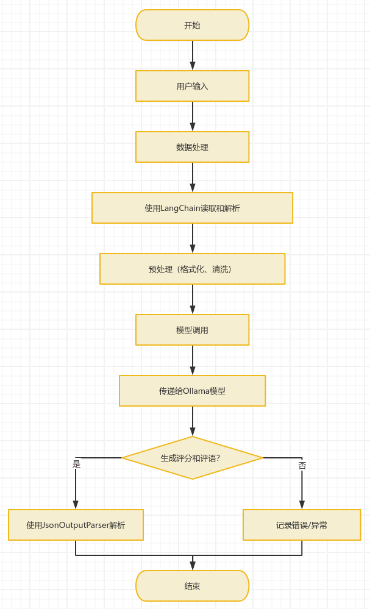

# homeworkLLM
基于ollama+langchain的大模型作业评审任务

## 功能特点
- 智能作业评审
- 自动化模型调配
- 简便的环境配置流程

## 模型调配
- **[demo.ipynb](demo.ipynb)**
- **[demo.py](demo.py)**

## 系统架构
- **用户交互层**: 通过前端界面收集学生的代码和实验报告。
- **服务层**: 使用 `FastAPI` 提供 RESTful API，处理用户请求并调用后端模型进行评审。
- **模型层**: 集成 `Ollama` 提供的语言模型，执行代码审查和实验报告评分任务。

## 环境配置
- **ollama**
```shell
curl -fsSL https://ollama.com/install.sh | sh
```
- **python**
```shell
conda create -n yourProjectName python=3.10
conda activate yourProjectName
pip install -r requirements.txt
```

- **model**
```shell
# download model

cd  model/qwen2.5
ollama create hwllm-qwen2.5 -f Modelfile
cd ../qwen2.5-coder
ollama create hwllm-qwen2.5-coder -f Modelfile
```

## 技术栈
### - **`ollama`+`langchina`**

#### 1. **Ollama**
- **模型管理**
  - 支持多种大型语言模型的快速部署和版本控制。
- **高效推理**
  - 提供异步处理能力，确保快速响应。
- **容器化部署**
  - 简化模型的部署和维护流程，提高可扩展性。

#### 2. **LangChain**
- **链式结构**
  - 设计复杂任务处理流程，将模型、提示模板和输出解析器组合成工作链。
- **记忆机制**
  - 使用 `ConversationBufferMemory` 保存上下文信息，增强多轮对话理解能力。
- **输出解析**
  - 通过 `JsonOutputParser` 确保输出格式符合预期，便于后续处理。

#### 3. **API接口**
- **[server/model/main.py](server/model/main.py)**
```shell
# 启动接口
cd server/model
bash run.sh
```
即可通过局域网（yourIP:8000）进行访问

### - **`fastapi`+`tortoise`**
  待更新

### - **`vue3`**
  待更新